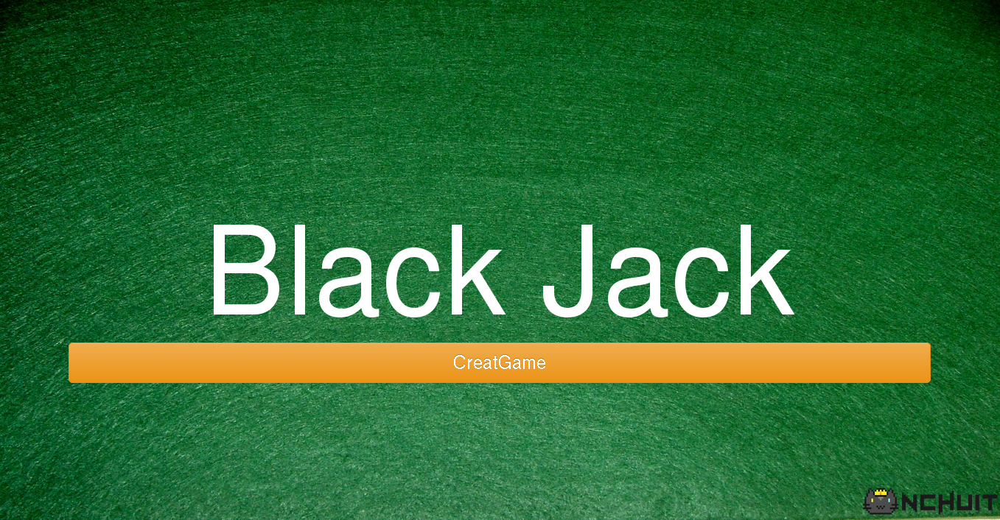
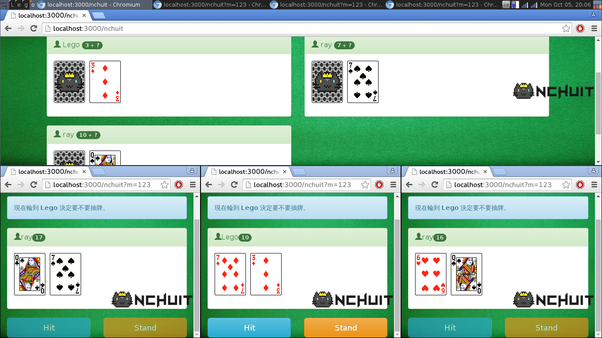

# Multiple Player Blackjack with WebSocket

這是一個用來練習 WebSocket 的多人 Blackjack 遊戲。





## 構想

主畫面 (投影機 or 螢幕) 顯示開啟新遊戲，點選開啟新遊戲後，網頁上顯示代碼及 QR code，以便手機加入遊戲 (使用手機 chrome 瀏覽器)。當人數足夠時，在主畫面按開始來開始遊戲 (至少兩人)。

開始遊戲後，主畫面顯示目前牌桌及提示輪到誰。接下來就是一般的二十一點規則。手機上只能看到自己的牌和點數，只有主畫面可以看到每個人的牌，遊戲進行中，玩家在主畫面上的牌會各有一張蓋牌。

當輪到玩家時在手機畫面上選擇是否要加牌。

## 參考資料

* [socket.io](http://socket.io/)
* [jQuery](https://jquery.com/)
* [node.js](https://nodejs.org/)
* database (mysql or redis)
* [21點遊戲規則](https://zh.wikipedia.org/wiki/%E5%BB%BF%E4%B8%80%E9%BB%9E)
* [hackpad 討論](https://nchuit.hackpad.com/blackjack-ws-Pnqo7KL9Hkx)

## 素材

牌面：<http://imgur.com/HqjFI5e>

### Install 

```
$ git clone git@github.com:NCHUIT/blackjack-ws.git

$ git checkout develop

$ npm install

```

### Usage

```

$ npm start

```

首先先開啟一個 Observer(PC) 按下 Start Button

然後再用一至多個裝置掃Qr code 進入遊玩

> 注意 本系統戰暫時以URL尾加上 Query String `m` 代表為手持裝置的判斷

**HAVE FUN ~ !**

### Contributor

- [taichunmin](http://taichunmin.idv.tw/)

- [杜杰](http://nyannyan.space/)

- [Lego](http://qas612820704.github.io/)
